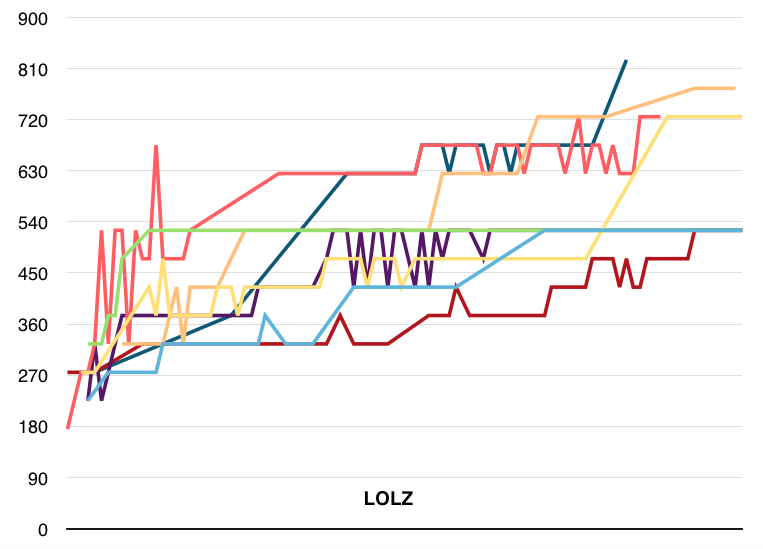

# IT3708: Project 2  – Programming an Evolutionary Algorithm (EA)
### Author: Petr Zvonicek

## a) Implementation

EA is implemented in Python using modules *numpy* for efficient computation, *matplotlib* for plotting and *PyYAML* for configuration management.

The entry point is the class *EA*. This class is responsible for initializing the population and the basic evolutionary loop. For each generation it calls adult selection, mating and mutation on *Population* object. *EA* also provides plotting and logging logic. *Population* class manages adults and children and handles their evolution. Instances of *Individual* class represents adults and children. This class has *genotype* property and provides a way to mutate it, convert it to phenotype and compute fitness.

The concrete algorithms for crossover, mutation, phenotype conversion, fitness computation, parent and adult selection are specified using the GoF Strategy design pattern, which ensures modularity of the system. Individuals are created using the GoF Abstract Factory design pattern. This makes the system more extendible and allows, for example, to modify the way the initial genotypes are generated.

 \


### Modularity

The EA holds the configuration in the globally accessible module *config*. This module contains configuration data extracted from *YAML* configuration file which is provided as an argument on launch. This configuration file holds all the configurable parameters such as population size, type of EA, adult/parent selector, phenotype convertor, fitness evaluator, mutation and crossover strategies etc. Sample of the configuration file is below.

```
population_size: 20
generation_limit: 200
...
adult_selector: !!python/object:ea.adult_selection.FullGenerationalReplacementAdultSelector {}
parent_selector: !!python/object:ea.parent_selection.SigmaScalingParentSelector {}
fitness_evaluator: !!python/object:ea_impl.one_max_problem.OneMaxFitnessEvaluator {}
```

Implementing a new AI is therefore just a matter of subclassing *FitnessEvaluator*, *Individual Factory*, *PhenotypeConvertor* (and possibly other classes if needed) so as to provide a new strategy and creating a new *YAML* configuration file with desired parameters. Example of a fitness evaluation strategy is below.

\newpage

```
class OneMaxFitnessEvaluator(AbstractFitnessEvaluator):
    def get_fitness(self, phenotype):
        ones = 0
        for bit in phenotype:
            if bit == 1:
                ones += 1
        return ones/len(phenotype)
```

## b) One-Max problem

Initial parameters: 40-bit vector, adult selection: full-generational replacement, parent selection: fitness-proportionate

At first, I run the simulation with **mutation rate 0.01** and **crossover rate 0.7**. The both average and maximum were converging to the fitness 1.0, smaller populations (<100) did not performed very well though and usually did not exceeded fitness 0.95 (first figure). I needed to go up to the **population of 300**, which gave me reasonable probability the fitness 1.0 would be reached within 100 generations. (second figure). Upon this population, I tried to experiment with mutation and crossover rates. Lowering the **mutation rate to 0.001** seemed to find the desired fitness in fewer generations. Tackling with crossover rate seemed to provide only small differences, but increasing it to 0.9 performed slightly better.\
After these tweaks, I was able to **lower the population from 300 to 170** while preserving the reasonable probability of reaching the fitness 1.0 within 100 generations. (third figure).

 \  \ 

### Experimenting with parent selection

Using the previous configuration, I've tried to use **sigma-scaling** instead of fitness-proportionate. The difference was enormous. Desired fitness was now reached within just 20 generations instead of 80-100 when used fitness-proportionate (first figure). Even better results were provided by **tournament** parent selection with group_size = 5 and epsilon = 0.1. The target was now reached usually within just 10 generations (second figure).

 \ 

### Modified target bit string

Modifying the target bit from all 1's to a random bit doesn't change a difficulty of the problem. For AI it is just one arbitrary bit vector which needs to be found. Following chart (first figure below) document this. I conducted 8 runs with random target vector (blue bars) and all 1's vector (green bars). There is no visible difference between these two targets, which confirms my assumption.

 \  \


### LOLZ

Results of LOLZ problem can be divided into the two cases – either the EA is building the vectors with leading ones, or the vectors with leading zeros. The former means a convergence to fitness 1.0 whereas the latter means convergence to fitness 0.525. The reason for this is simple. At first the both leading ones and leading zeros performs equally. The AI will then start to focus on one of these. If zeros are preferred, it proceeds until reaching 21 leading zeros where the fitness will stop growing. In this state, the only way to enlarge the fitness is to have 22 leading ones. However, the individuals are now too specialized on leading zeros and diversity for such a major switch is too low, so the AI gets stuck on fitness 0.525. This behaviour is documented by 8 different runs visualized on the provided chart (second figure above).

## c) Suprising Sequences

### Encoding

Genotype is represented by a bit vector with sequence symbols encoded in binary. Binary code of the symbols is aligned to the equal size by adding leading zeros. Genotype-Phenotype conversion consists of grouping the bits into the string representing one symbol (depicted as a black line below the bits) and binary-decimal conversion. Phenotype is then a list of symbols.

 \


### Fitness functions

Fitness functions for both globally and locally surprising sequences share the common procedure. This procedure checks if the sequence is surprising for given *d* (distance between symbols *A* and *B*). The procedure goes through the word, saves all the possible (BEGIN_LETTER, END_LETTER) tuples for the desired length and counts its duplicates.

For locally surprising is this procedure called just with *d=0*. In contrast, for globally surprising is this procedure called multiple times with *d* from range *[0, L - 2)*, where *L* is the length of the word.

Finally, the fitness is computed as *1/(1 + C)*, where *C* is the sum of all the duplicates found by the previous procedure.

### Globally surprising sequences

| S  | Pop. size  | Num. of gen. | L  | Sequence |
|----|------------|--------------|----|----------|
| 3  | 100        | 1            | 7  | 0, 0, 2, 1, 2, 0, 1 |
| 5  | 100        | 5            | 12 | 4, 1, 2, 0, 2, 3, 3, 0, 1, 4, 2, 1 |
| 10 | 100        | 5215         | 25 | 9, 2, 0, 3, 5, 6, 7, 8, 1, 4, 1, 7, 6, 2, 2, 9, 1, 8, 4, 0, 5, 8, 0, 6, 3 |
| 15 | 100        | 3885         | 38 | 9, 13, 14, 2, 6, 0, 1, 6, 9, 3, 10, 8, 7, 12, 7, 4, 5, 11, 11, 0, 12, 10, 11, 13, 1, 0, 3,\
8, 5, 14, 4, 2, 13, 9, 10, 7, 6, 8 |
| 20 | 100        | 4089         | 49 | 1, 6, 7, 15, 13, 14, 18, 16, 15, 10, 17, 4, 0, 1, 4, 11, 18, 2, 12, 7, 10, 8, 13,\
19, 12, 2, 14, 9, 5, 16, 5, 9, 0, 14, 13, 8, 3, 3, 1, 19, 18, 6, 11, 4, 8, 7, 17, 0, 16 |

### Locally surprising sequences

| S  | Pop. size  | Num. of gen. | L  | Sequence |
|----|------------|--------------|----|----------|
| 3  | 100        | 3            | 10 | 0, 2, 1, 1, 0, 1, 2, 2, 0, 0 |
| 5  | 100        | 11           | 26 | 2, 0, 0, 1, 4, 1, 0, 3, 4, 0, 4, 3, 1, 1, 2, 1, 3, 3, 2, 4, 4, 2, 2, 3, 0, 2 |
| 10 | 100        | 7439         | 100 | 7, 2, 0, 9, 2, 7, 1, 3, 8, 3, 3, 5, 2, 8, 2, 2, 6, 7, 3, 2, 5, 0, 2, 3, 9, 3, 4, 5, 7, 4,\
2, 1, 1, 7, 8, 4, 6, 6, 4, 8, 0, 4, 3, 7, 7, 0, 3, 6, 5, 6, 3, 0, 7, 5, 8, 6, 2, 4, 9, 9,\
6, 8, 9, 8, 5, 9, 7, 6, 1, 4, 4, 1, 6, 0, 0, 5, 4, 0, 1, 0, 6, 9, 4, 7, 9, 5, 1, 9, 1, 8,\
8, 1, 5, 5, 3, 1, 2, 9, 0, 8  |
| 15 | 100        | 9258          | 195 | 6, 0, 3, 2, 6, 2, 9, 8, 5, 14, 4, 2, 10, 6, 7, 12, 10, 2, 11, 10, 8, 14, 8, 9, 13, 11, 6,\
5, 3, 11, 8, 0, 8, 4, 7, 8, 13, 7, 5, 6, 12, 12, 4, 9, 11, 14, 9, 7, 6, 10, 12, 6, 1, 1,\
13, 2, 5, 5, 0, 5, 13, 6, 8, 12, 5, 2, 1, 9, 12, 7, 14, 11, 2, 2, 13, 3, 7, 10, 11, 1, 0,\
2, 12, 11, 7, 0, 14, 12, 14, 3, 12, 13, 5, 11, 12, 1, 14, 1, 7, 1, 5, 4, 0, 9, 6, 14, 5,\
12, 3, 8, 11, 9, 4, 12, 2, 3, 3, 4, 11, 11, 0, 7, 3, 13, 12, 8, 6, 11, 5, 8, 1, 2, 8, 7,\
11, 4, 8, 8, 10, 10, 5, 7, 9, 9, 10, 13, 10, 3, 14, 2, 7, 2, 4, 1, 3, 0, 11, 3, 9, 1, 6,\
4, 10, 4, 6, 3, 10, 1, 4, 14, 13, 13, 14, 0, 0, 12, 0, 13, 8, 2, 0, 6, 13, 4, 4, 5, 10, 7,\
7, 4, 13, 9, 0, 1, 12 |
| 20 | 100        | 6243        |  261 | 13, 5, 16, 18, 8, 8, 1, 6, 17, 10, 1, 12, 8, 17, 0, 2, 18, 5, 8, 18, 19, 7, 13, 1, 7, 5, 0,\
17, 2, 4, 18, 1, 9, 1, 3, 19, 12, 10, 5, 12, 12, 4, 4, 3, 3, 5, 10, 19, 1, 2, 10, 2, 7, 18,\
12, 18, 13, 14, 12, 6, 5, 5, 2, 12, 1, 5, 17, 7, 3, 15, 15, 0, 19, 19, 5, 15, 6, 0, 18, 10,\
6, 8, 15, 8, 2, 9, 19, 16, 13, 11, 0, 1, 16, 9, 7, 7, 1, 1, 18, 3, 2, 17, 18, 18, 2, 19,\
14, 16, 2, 1, 8, 7, 11, 8, 6, 1, 0, 9, 12, 9, 2, 2, 15, 10, 9, 5, 18, 11, 9, 0, 13, 3, 4,\
0, 7, 10, 7, 12, 11, 1, 11, 15, 18, 0, 0, 8, 0, 3, 18, 16, 11, 5, 3, 14, 10, 11, 17, 17,\
12, 5, 6, 16, 12, 2, 13, 7, 14, 5, 19, 6, 13, 15, 19, 0, 5, 1, 14, 3, 1, 13, 9, 4, 7, 9,\
17, 1, 4, 19, 9, 6, 11, 12, 15, 9, 13, 4, 14, 9, 14, 7, 19, 4, 11, 16, 1, 15, 11, 2, 3, 10,\
12, 0, 6, 18, 15, 2, 8, 14, 13, 17, 3, 8, 9, 15, 13, 16, 6, 7, 2, 6, 15, 14, 18, 14, 6, 10,\
14, 0, 4, 10, 15, 17, 16, 16, 10, 18, 17, 19, 17, 8, 4, 15, 12, 17, 9, 16, 4, 8, 19, 11, 13 |

## d) Difficulty

- **One-Max** is the simplest of all. Fitness function is very straightforward and there are no problems with local optima (the only optimum is the fitness 1.0).
- **LOLZ** is difficult problem mainly because of the existence of local optimum with leading zeros. From this state, it is very hard for the AI to proceed and adapt to the new state with leading ones.
- **Locally-surprising sequences** - for the both locally and globally surprising sequences apply that they are difficult problems. EA has no guarantee if it is possible to reach the top fitness and fitness function is not (at least in my case) very accurate and stable (mutation of one bit may strongly influence fitness).
- **Globally-surprising sequences** has more difficult fitness computation which requires to go through the multiple distances (*d*).