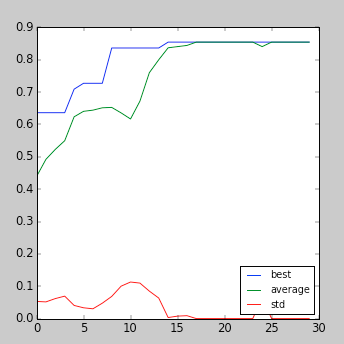
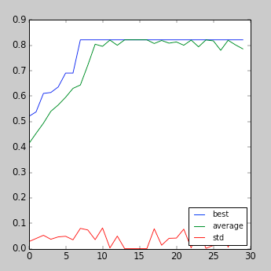
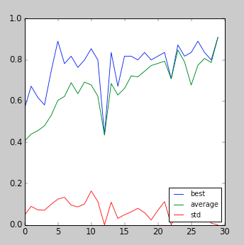
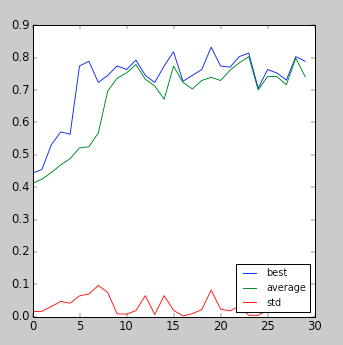

# IT3708: Project 3 – Evolving Neural Networks for a Flatland Agent
### Author: Petr Zvonicek, Eva Tesarova

## a) EA choices

### EA parameters

The most successful parameters are depicted in the table below along with the Generation Mixing adult selection and Sigma Scaling parent selection. The exploratory process involved adjusting the values and trying them out on the flatland. We then looked at the maximum fitness, fithess graph and also the behaviour of the agent. By making changes we tried to converge to the optimal configuration of the EA. We also used our experience with the EA from the Project 2.

| Crossover rate | Mutation rate | Population size | Generation limit | Elitism size |
|----------------|---------------|-----------------|------------------|--------------------|
| 0.8            | 0.01          | 30              | 30               | 5 |

### Fitness function

The fitness function is very straightforward. Each eaten food is rewarded by 1 point and each poison is punished by 1 point. The fitness is then normalized to interval [0, 1].

In other words, the fitness is computed by this formula (including the normalization):

 &nbsp; &nbsp;

$\dfrac{numEatenFood - numEatenPoison + totalPoisonNum}{totalFoodNum + totalPoisonNum}$

 &nbsp; &nbsp;

We tried to punish eating poison by more points than eating food, but this ultimatelly resulted in worse fitness. The agent was overly careful and also often ended up cycling in the loop.

## b) Implementation

### ANN architecture

Our ANN architecture cosists of three fundamental parts – network, layer and neuron.

The smallest part of the ANN is a neuron represented by class *Neuron*. The neruon is initialized with integer representing number of inputs, activation function and a bool variable enabling the bias. The neuron is responsible for storing its input weights. The key part of the neuron is the function *compute* that receives *input values* and performs the integration. Finally, the *compute* method returns an output of the activation function.

Neurons are grouped into layers represented by class *Layer*. Layer is initialized with a list of neurons and provides just two methods – *compute* and *weights_count*. *Compute* takes input values and returns a list of results from all layer's neurons. *Weights_count* simply computes the total number of weights in all layer's neurons. 

Finally, the whole network is represented by class *Network*. Network is initialized with a list of layers. *Compute* method just call *compute* on all the children *layers* and takes as an input either input values (for the first layer), or output from the previous layer (all other layers). *Set_weights* method takes a list of weights (phenotype) and extracts this weights to all the child neurons.

This is the basic framework for ANN, the concrete ANN is then created by a *factory* class, subclass of *AbstractAnnFactory*. 

### Process of finding the design

At first, the topology of our ANN was very simple. We did not have any hidden layer and the network contained only the input layer and the output layer with 3 neurons activated by *Step function*. The result was then interpreted as a random choice of all positive outputs. This design provided reasonable performance (usually ~22 food and ~5 poisons), but we found some problems with that. The simulation was highly nondeterministic and the same world provided different results on repeated runs. It was also difficult to understand certain agent behaviour. For example, the agent often decided to turn to eat a poison although there was empty space around and the punishment for this behaviour was quite big.

On TA sessions we were recommended to remove randomness and to try to use a continuous activation function instead of a discrete one. That's how we got to our final design.

### Final ANN design

The final ANN for Flatland consists of the input, hidden and output layer. The hidden layer contains 6 neurons and all of them are connected to all input and output neurons. We found out that the best performing activation function for the hidden layer is *hyperbolic tangent*. We also used a bias on the neurons of the hidden layer to make it more stable. The output layer performed best with simple activation function which just returns the integrated values. The direction is then chosen by the maximum value from the all three outputs. If more outputs has the same value, one of those is randomly chosen.

The weights are from interval [-1, 1] and the initial values of the weights are from interval [-0.1, 0.1]. This was recommended to us on lectures and we can confirm that this configuration performs well.

A lot of tweeking has been done regarding the fitness function. Our agent often suffered from looping around. We believe there is not much to be done about this problem as the ANN does not remember past states to detect and interrupt the looping. However, this problem was significantly reduced by lowering the punishment for eating a poinson from 5 to 1.

We also tried to interpret output results in manner of "roulette selection", but this approach didn't work at all since the output values were very close to each other and therefore the actions were chosen nearly randomly. 

## c) Performance

### 1) Static run, 1 scenario

In this run, the static agent had very good performance and ate 28 food and 2 poison (28x2). Random scenarios were very changeable, usually the performance was about 15 food and 3 poison (15x3), but sometimes it was better or worse.

The behaviour can be seen as overfitting, the neural network is specialized for solving just one scenario and is not general enough to consistently perform well on different scenarios.

### 2) Static run, 5 scenarios

This run had slightly worse performance on static scenarios than the previous one (25x2, 25x0, 20x0, 25x2, 26x1), but random scenarios had higher performance (usually around 20x1). However, some random scenarios had still very low performance (around 12 food) and the agents sometimes got stucked on looping.

Obviously this run was less affected by overfitting and evolved more general behaviour.

### 3) Dynamic run, 1 scenario

Regarding the real performance, it is difficult to generalize the behaviour and compare it with the previous configurations. The results were again very changeable and sometimes performed well (28 food) or very bad (3 food). In general, it seems that this run provides lower performance more often than the previous runs. 

The plot is clearly less smooth, which is because the scenarios are randomly generated after each generation and they performs differently using the same weights. It can also be affected by somehow extreme scenarios (exceptionally easy or difficult).

### 4) Dynamic run, 5 scenarios

This run was the best performing from all the others. The high performances remained on the same level as in Static run with 5 scenarios, but there was significantly lower amount of poor-performing scenarios.

This is caused by the fact that the network is each new generation trained on different scenarios so this will evolve more general weights. The plot seems to be more stable than on dynamic run because we are computing the average of 5 different scenarios on each generation. This may hide the most extreme cases (particularly easy or difficult scenarios).

