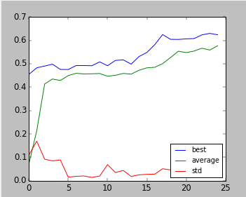
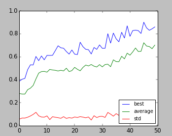

# IT3708: Project 4 – Evolving Neural Networks for a Minimally-Cognitive Agent
### Author: Eva Tesarova, Petr Zvonicek

## a) Implementation

### Genotype / Phenotype representations

Genotype is a bit vector and is divided into 8-bit chunks representing one decimal number (0 - 255). This decimal number represents one weight – one item of the phenotype. The genotype - phenotype conversion is done by converting the binary number to decimal, linear scaling (decoding) of the [0, 255] interval into the desired interval of the weight (eg. [-5, 5]). The phenotype - genotype conversion is slightly more complicated, it requires finding the closest value in the scaled values, encoding this value to [0, 255] interval and converting this to binary.

### CTRNN
The *CTRNN* is a subclass of the network from Flatland project. In addition to that, we added some attributes (bias weight, gain, time constant) needed for *CTRNN* output computation to the neurons.

The motor output is formed by two neurons (each represents one direction), which gives output in range $[0, 1]$. The tracker direction is determined by the neuron with a higher output value. The speed of the tracker is then computed from the value of the "winning" neuron. Multiplying this value by 5 we scale its output to the 4 possible speeds. 

For the pull extension we added one more neuron to the output layer. The neuron has the same properties as the others in this layer. Interpreting the output, pull action is performed if the value is higher than $0.5$.

## b) Performance

### Standard scenario

In the standard scenario the agent always choose one direction at the beginning and this direction is then hold for the rest of the simulation. Its behaviour under the objects is various, depending on run of our EA. Two main approaches can be seen:

- The tracker is going fast, in the first run through the world it "scans" the object and in the second run stops under the object (if it's small).

- The tracker is going slower and when it's under the object, the tracker tries to catch it at its side part. If the tracker sees that the object is big, it just passes without stopping under it.

We often experienced problems with catching objects after previous successful catch. If the new object appers at the similar position as the previous one, the tracker usually just stand still and don't make any effort to adjust to the new object.

Every time the object hits the floor, the fitness function is computed. We count punishment for not taking small object and not avoiding big one, then we count rewards for taking small object and avoiding big one. Fitness is given as the sum of those. This concept remains the same for all scenarios except the non wraparound (see No-Wrap section), but the actual reward/punishment values differ. The fitness plot is shown on the first figure below.

### Pull scenario
On the pull scenario the agent behaves similarly as in the standard case. Instead of just standing still, it now pulls the object down so as to save the time. Sometimes, immediately after pulling the object down, the tracker mistakenly pulls down the next bigger object too. The second figure below shows how the EA learns to capture the objects. The jump around 17th generation indicates learning the pull action.
 
### No-Wrap scenario

This scenario is probably the most difficult for our EA as it involves a huge factor of luck. We added two more sensors to the input layer detecting the walls (on the right and left). We also made the weights of the wall sensors twice higher. We managed to teach the agent how to turn after hitting the wall as well as how to capture objects (it was not able to avoid bigger ones, though). However, teaching the agents this behaviour demands many runs of EA and it is very sensitive to initial conditions. We gave the agent a big reward for turning back out of the wall. However, the agent can obtain this reward only few times per run so as to avoid continuous hitting the wall. This approach seemed to be good since the agent learns the both capturing objects and turning after hitting wall. This development is shown on the third figure below where the two jumps are perceptible, first represents turning from the wall, second represents capturing the objects.

 \  \  \

## c) CTRNN Analysis

We use the same topology as proposed in the assignment. Lets mark neuron from the input layer as $i_1, \dots, i_5$, neurons from the hidden layer as $h_1, h_2$, neurons from the motor output layer as $o_1, o_2$ and the bias neuron as $b$. One of the evolved ANN weights is following:

|to\\from| $i_1$ | $i_2$ | $i_3$ | $i_4$ | $i_5$ | $h_1$ | $h_2$ | $o_1$ | $o_2$ |  $b$  |
|-------|-------|-------|-------|-------|-------|-------|-------|-------|-------|-------|
| $h_1$ |  5.0  |-4.647 |-4.058 |-1.274 |  5.0  | 2.019 | 2.294 |       |       |-1.019 |
| $h_2$ |-3.862 | 0.098 | 3.980 |-2.960 |  5.0  | 1.352 | 3.0   |       |       |-0.352 |
| $o_1$ |       |       |       |       |       | 2.176 | -1.0  |  1.0  | -3.0  |-0.705 |
| $o_2$ |       |       |       |       |       |  -3.0 | 4.294 |  1.0  |  5.0  |-9.019 | 

|              | $h_1$ | $h_2$ | $o_1$ | $o_2$ |
|--------------|-------|-------|-------|-------|
|gains         | 4.921 | 3.996 | 2.003 | 2.992 |
|time constants| 1.0   | 1.250 | 1.003 | 2.0   |

Agent with this weights always takes left direction. It is well seen on the biases – the bias for the right motor output is very low so the agent never takes an action to the right (the decision is based on the maximum of the outputs of the *motor output neurons*). The weights on the edges of tracker are the most significant ones (to detect if the object is above the tracker), so their weights are very high. Left motor output needs more information from the $h_1$, because he needs to quickly miss the potential big object. So the weight for this neuron is bigger. The second output neuron gives feedback to the left one when it sees the object. So the value of the left is getting lower and the tracker stops. 
We observed a significant relationship between the weights. The high positive weights from certain neurons allows the tracker to speed up, in contrast, the deep low weights from the other ones allows the tracker to stop under the object (lower input -> lower state value -> lower output).

For inputs `[[1,1,1,0,0], [1,1,1,0,0],[1,1,1,0,0]]` the network returns `[0.1004982589701444, 1.7124585674299352e-05], [0.04159479854050314, 3.204724235117445e-06],[0.03441738614485795, 1.6194432630797721e-06]`. This corresponds with the agent behaviour when it stops under the object (i.e. first output is getting lower because of the feedback from the other neurons). If we "let the object fall" from the opposite side of the tracker, i.e. inputs `[[0,0,1,1,1], [0,0,1,1,1],[0,0,1,1,1]]` returns `[0.7243432766232919, 1.0510463627465613e-05], [0.9159772553264353, 9.160789065372894e-08], [0.9414226330411551, 1.1391061986261452e-08]`, thus we can see tracker will not stop. In other words, we observed that the front neurons are crucial for the movement decision.